# Gaussian Mixture Model

## Gaussian Mixture Model formulation

where

-  is the data
-  is the model parameters 
-  is the weight of the i​-th Mixture component
-  is the mean of the i​-th mixture component 
-  is the covariance matrix for the mixture component

## Algorithm 1: Expectation-Maximization

We suppose that there is latent states which describe the system and an some distribution for the observations that depend on those hidden states. We thus want to maximize the  log-likelihood of the data given the parameters of the hidden states and of the probabilistic model choose for the observations, log p(X|theta ). Let's suppose a variational distribution and consider the Kullback-Leibler divergence between that variational distribution and the one of the hidden states of the data:

We set the q(z|X) variational distribution to be $p(z|X, \theta)​$ to obtain the optimal solution. 

Even tho the distribution used is optimal, the EM algorithm cannot guarantee to find the global maximum and can stay in local maximum. We thus make many random restarts and keep the best result. The expectation-maximization is a point estimate of the a maximum log-likelihood lowerbound with an E-step (assignment step) which calculate the probability of each latent variables given the parameters $\lambda​$ and an M-step which calculate the parameter that maximize the lower bound. The implementation is in numpy. 

### E-step:

The general formula is 

where L is the likelihood, q are the hidden states probabilities and $\theta​$, the model (Gaussian) parameters, is kept fixed. For the Gaussian Mixture Model, we have that

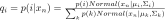

### M-step:

The general formula is 

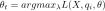

where L is the likelihood, and q are the hidden states probabilities which are kept fixed. For the Gaussian Mixture Model, we have that 

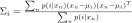

## Algorithm 2: Variational Bayes

This approximation can be thought as the mean field approximation where we set:

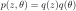

Instead of having a point estimate of the posterior we have a full posterior distribution.

We have that the KL divergence becomes

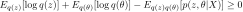

which give the evidence lower bound (ELBO)

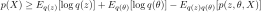

And minimizing with respect to $ q(z) ​$ and $ q(\theta) ​$ correspond to find the tightest lower bound. We should take note that this doesn't mean that the log-likelihood is improved.  The implementation use the Stochastic Variational Inference in Pyro. For more information, you can check [Automatic Variation Inference](https://arxiv.org/pdf/1301.1299.pdf) and the [pyro svi documentation](http://pyro.ai/examples/svi_part_i.html)

Results:

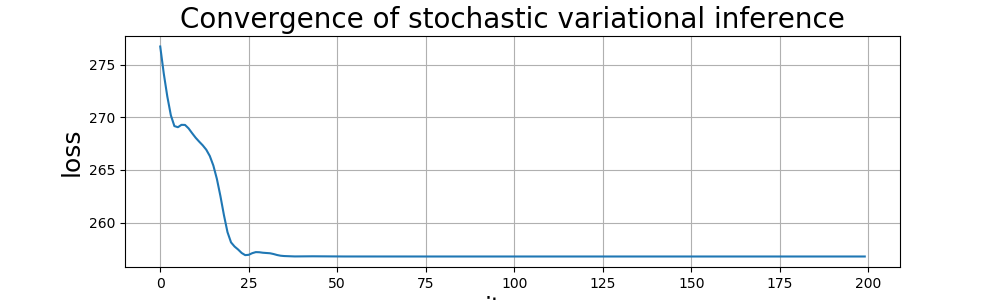

## Algorithm 3: Markov chain Monte-Carlo

The model for the Markov Chains Monte-Carlo (MCMC) is defined as follows:

All the parameters have priors

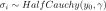

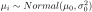

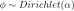

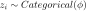

and  the observations are modeled as:

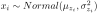

Sampling is made using [NUTS](https://arxiv.org/pdf/1111.4246.pdf).

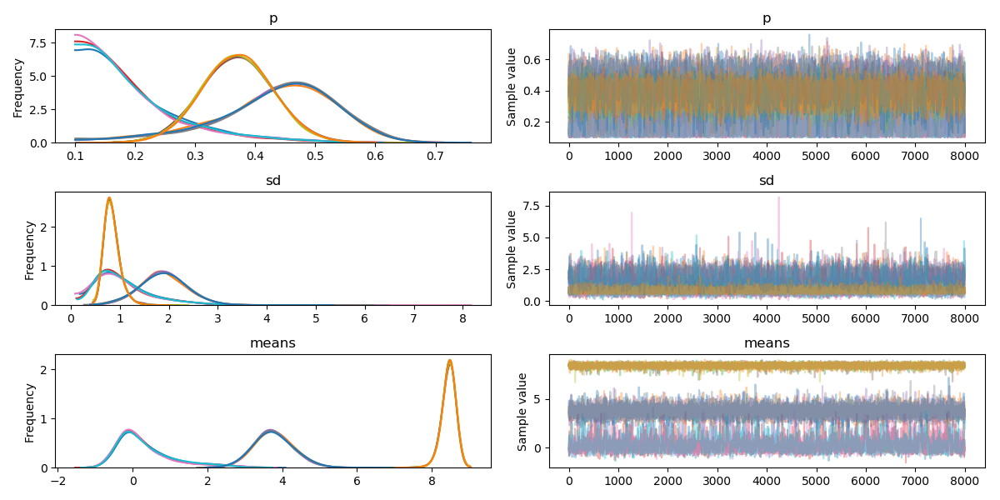

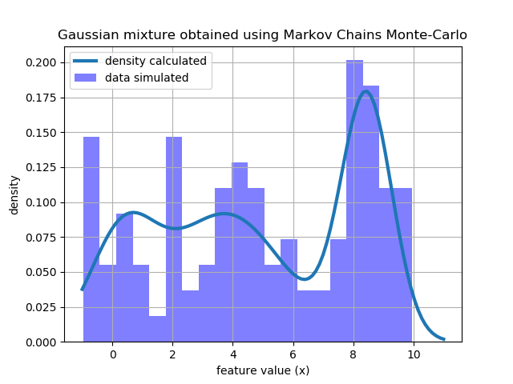